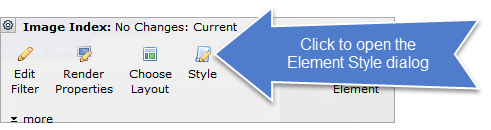
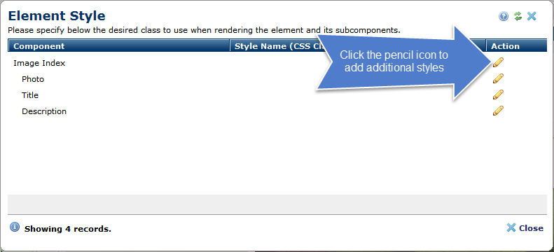
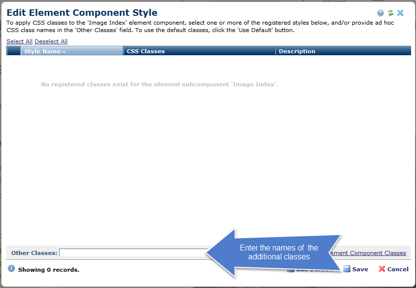

Image Index Justified
=====================

A render handler for the CommonSpot standard element Image Index.

A grid of photos where all the photos in a row are the same height and all the rows are around the same height.

Installation
------------

-   Copy the contents of the `dist` directory to your CommonSpot server
    -   `cf`, `css` and `js` directories
    -   Probably into the `_cs_resources` directory
    -   Probably to `<your site>/_cs_resources/image-index-justified`
-   Add a render handler to the Image Index standard element
    -   Probably named &ldquo;Justified&rdquo;
    -   Specify an explicit module
    -   `<dist>/cf/image-index-justified.cfm`
-   Register a resource for the JS and CSS used by this render handler
    -   Probably name "Image Index: Justified"
    -   Early Loading
        -   URL: `/<dist>/css/image-index-justified.min.css`
        -   Type: **StyleSheet**
        -   Combine: **Ticked**
        -   Minify: **Unticked**
    -   Late Loading
        -   URL: `/<dist>/js/image-index-justified.js`
        -   Type: **JavaScript**
        -   Combine: **Ticked**
        -   Minify: **Unticked**

External resources
------------------

All these resouces are assumed to be registered and are referred to in `<dist>/cf/image-index-justified.cfm`

### Required

-   [PhotoSwipe](http://photoswipe.com/)
    -   **Only** the CSS files
    -   `photoswipe.css`
    -   `default-skin.css`
        -   *Or another skin*
-   [photoswiper](https://github.com/sh0ji/photoswiper)
-   [justified-layout-browser](https://github.com/Sporkyy/justified-layout-browser)
    -   In-browser implementation of [Flickr's Justified Layout](https://github.com/flickr/justified-layout)
-   [Picturefill](http://scottjehl.github.io/picturefill/)

### Optional

-   [babel-polyfill](https://www.npmjs.com/package/babel-polyfill)
    -   IE support
-   [polyfill-nodelist-foreach](https://www.npmjs.com/package/polyfill-nodelist-foreach)
    -   For IE support
-   [element-closest](https://www.npmjs.com/package/element-closest)
    -   For IE support

Element Style
-------------

The Justified Image Gallery is implemented as a Render Handler on the Image Index standard CommonSpot element.

Customization is implemented through use of the styles on the subcomponents of the element.

Style Options
-------------

### Image Index

Themes will set groups of colors and sizes not easily set with individual classes

-   `background-color-<hex>`
    -   The background color behind all the photos.

    -   *Use 3, 4, 6 or 8-digit hexadecimal notation without a pound sign.*
-   `full-width-breakout-row-cadence-<boolean|integer>`
    -   Insert a full width photo every `integer` rows.
    -   The photo on that row will be as wide as the width of the row and as tall as its aspect ratio.
    -   *Only if that photo has an aspect ratio.*
-   `spacing-<integer>`
    -   Spacing around the photos.
    -   *In pixels.*
-   `target-row-height-<integer>`
    -   Rows will be as close to `integer` high as possible.
    -   *No guarantees.*
    -   *In pixels.*
-   `theme-default`
-   `theme-shadow-box`
    -   Many drop shadows.
    -   *Too many drop shadows, some might say.*

### Photo

-   `caption-background-color-<hex>`
    -   The background color of the caption
    -   *The caption will only be visible if either the title or description are visible.*
    -   *Use 3, 4, 6 or 8-digit hexadecimal notation without a pound sign.*
-   `spacing-<integer>`
    -   Spacing between the photos in pixels.
    -   *In pixels.*

### Title

-   `color-<hex>`
    -   The color of the titular text.
    -   *Use 3, 4, 6 or 8-digit hexadecimal notation without a pound sign.*
-   `size-<integer>`
    -   The size of the titular text.
    -   *In pixels.*
-   `visible`
    -   Add a caption with a title to every image.

### Description

-   `color-<hex>`
    -   The color of the descriptive text.
    -   *Use 3, 4, 6 or 8-digit hexadecimal notation without a pound sign.*
-   `size-<integer>`
    -   The size of the descriptive text.
    -   *In pixels.*
-   `visible`
    -   Add a caption with a description to every image.
